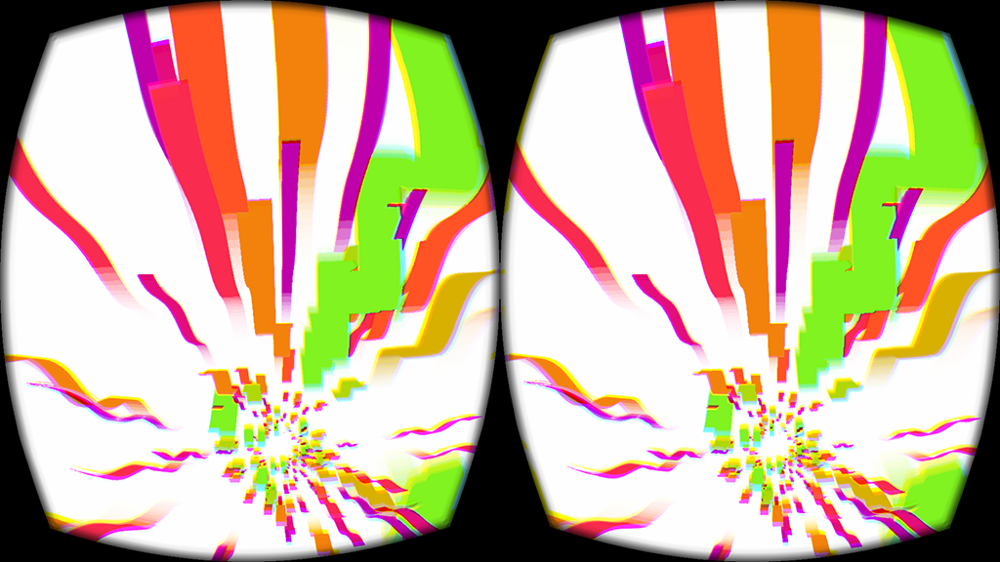
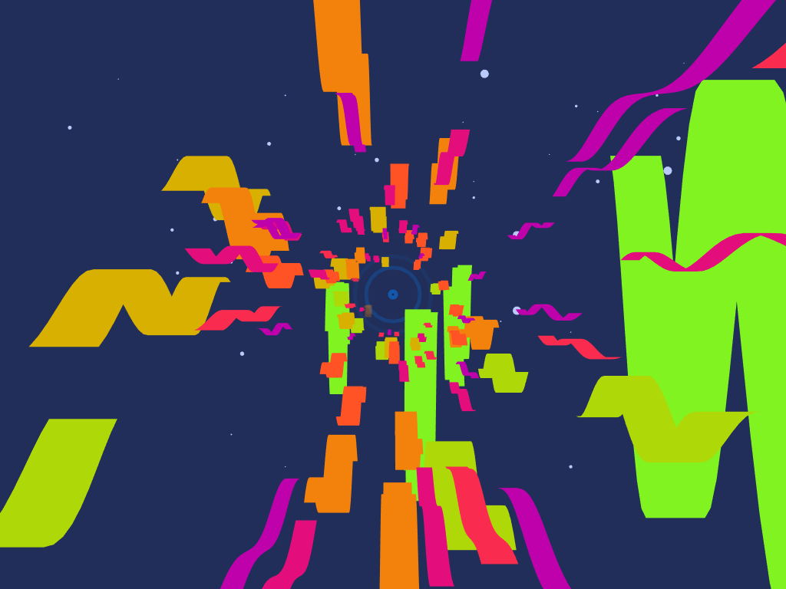

# Ribbons

A little music visualizer with Oculus Rift support. Made with [Cinder](http://libcinder.org/).

Turn VR on and off by changing `VR=1` to `VR=0` or vice versa in Build Settings > "Preprocessor Macros Not Used In Precompiled Headers".

#### Keyboard

- `N` to toggle night/day mode
- `T` to toggle trails
- `P` to pause
- `esc` to close

## Building

Build using Xcode. Cinder and OculusSDK are expected to be in your home folder by default, but this can be changed using the `CINDER_PATH` and `LIBOVR_PATH` build settings.

## To do

- smooth out amplitude
- add lines with l/r spectrum along sides or volume history
- show song info and album art: [taglib](https://github.com/taglib/taglib) or [id3lib](http://id3lib.sourceforge.net/)

### OVR

- use ovrHmd_GetFovTextureSize
